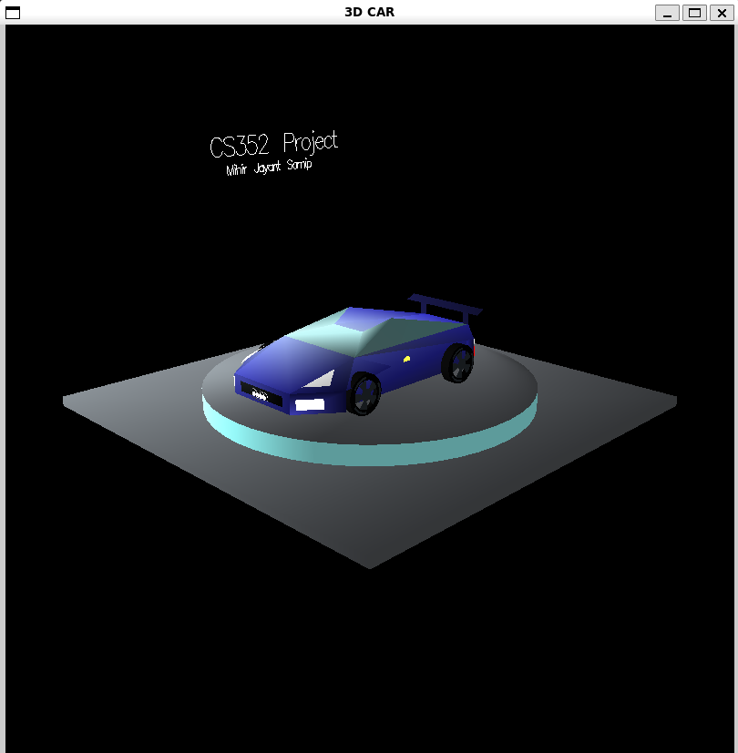

# CS352 Project: 3D Car Model

The goal of this project is to develop a 3D model of a car using OpenGL. Basic OpenGL functions such as `glPolygons`, `glLighting`, `glMaterial`, and `glLines` were utilized in the creation of this model.

You can preview the car in the image provided below:



To run this file, follow these steps:

1. **Clone Repository:** Clone the project repository to your local machine.
2. **Install Dependencies:** Install the necessary dependencies to run a simple OpenGL file.
3. **Compile Source Code:** Compile the `car.cpp` file using the following command:
   ```
   g++ car.cpp -lglut -lGLU -lGL -o car
   ```
4. **Execute Program:** Run the compiled program using the following command:
   ```
   ./car
   ```
   (For Linux/WSL)

Feel free to explore and modify the source code to understand how the car model was created and rendered in OpenGL.

## Credits and Acknowledgement

We borrowed some code snippets and wireframe from the following project:
- [MyCity-CarGame](https://github.com/sckorpio/MyCity-CarGame)

## References

- [LearnOpenGL](https://learnopengl.com/)
- [Microsoft Windows OpenGL Documentation](https://learn.microsoft.com/en-us/windows/win32/opengl/)

These references provided valuable insights and guidance during the development of this project.
